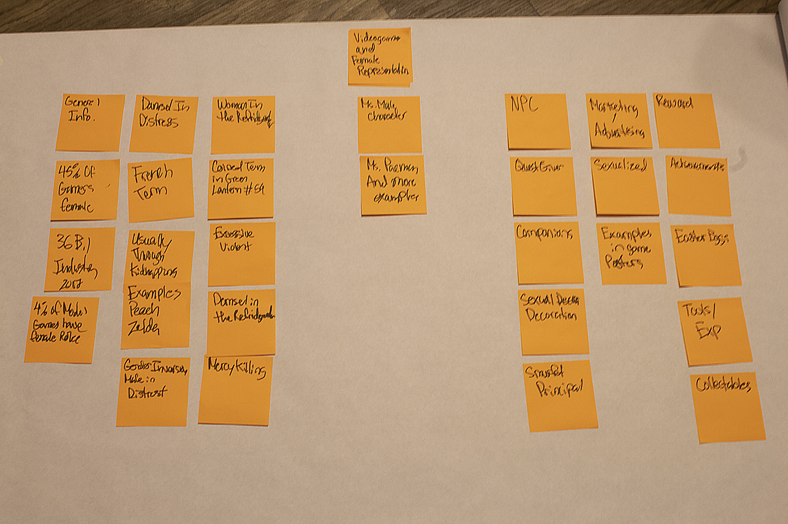
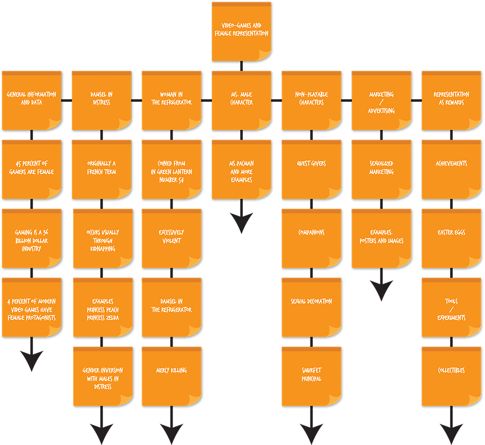
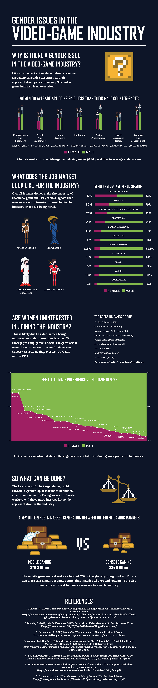

# Video Game Gender Issues

## Infographic Poster

__Roles__
- Researcher
- Graphic Designer
- Visual Designer

__Date and Time__
- 09.01.18 to 10.13.18

__Tools__
- Adobe Photoshop
- Adobe Illustrator
- Adobe InDesign

---

## The Challenge

Being a new medium, the video-game industry is providing modern entertainment for all types of people. Like most other tech-based industries, inequality between females and males is problematic. Organizations such as Feminist Frequency have brought attention to the literature of games being male-centered. The criticism was not received well by adult male video-gamers.

As a challenge given through my class at RMCAD, I made the decision to address a few of these issues for women through data visualization.

---

## Discovery & Research Analysis

A main criticism about Gender Issues in the video-game industry is presented in a way that flags men as the instigators and cause. This would have not been problematic if the research and information was better presented. Most of the research initial involved looking through Feminist Frequency[^1] Video Series.  To achieve an objective stance,  information regarding the quantitative data was needed.

[^1]: Anita Sarkeesian, Jae Lin. Feminist Frequency, September 1, 2018. https://feministfrequency.com/

<i>Information architecture done with post-it notes</i>
 

<i>Information architecture digital</i>
 

---

## Sketches & Ideation

<i>Early sketch detailing a few icons and layout</i>
 

<i>Vector Skecth of the poster</i>
 

---

Illustrative concept created with a sprite sheet. Information displayed as a video-game dungeon. More information about sprites sheet [here](https://www.codeandweb.com/what-is-a-sprite-sheet)[^2].

[^2]: Andreas Löw. What is a Sprite Sheet, September 01, 2018. https://www.codeandweb.com/what-is-a-sprite-sheet

<i>Early Sprite Sheet</i>
 

<i>Draft One</i>
 

<i>Female Sprite</i>
 

<i>Male Sprite</i>
 

<i>Frdige of Bodies Sprite</i>
 

<i>Bowsette Sprite</i>
 

<i>Heart Sprite</i>
 

<i>Computer desk sprite</i>
 

<i>Morrigan Sprite</i>
 

<i>Sprite of Scales</i>
 

---

## Style Guide

|Colors|||
|--|--|--|
|White #FFFFFF 255, 255, 255|Dark Blue #0A1629 10, 20, 31|Leaf Green #83B84A 131, 184, 74|
|Dark Purple #9E1F63 158, 31, 99|Rich Black #000000 0,0,0|--|

__Fonts__

- Agency FB Bold
- Lora Bold

---

## Solution and Impact

With data visualization being represented by video-game icons and imagery, information regarding Gender Issues can be non-invasive to male-gamers. 

 

